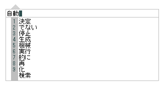

<!-- title:CLIME - Common Lisp Imput Method Engine  -->
<!-- style:./images/default.css -->

# CLIME

　CLIME (Common Lisp Input Method Engine) は予測変換型のテキスト入力システムです。


　　

　CLIME は増井俊之氏が作成した POBox に改変を加えたアプリケーションです。
サーバは Common Lisp 言語で完全に書き直されており、クライアントプログラム
にも多くの変更が加えられています。


## このパッケージに含まれるファイルについて

　このパッケージ（clime-winpkg）は Windows での利用のためのパッケージであり、
実行可能ファイルなどのソースコードは別のリポジトリで管理されています。

* `*.dict` : [clime-dict](https://github.com/clime-project/clime-dict.git)
* `climesrv.exe` : [clime-server](https://github.com/clime-project/clime-server.git)
* `winclime.exe` : [clime-client-windows](https://github.com/clime-project/clime-client-windows.git)

## インストール

　ダウンロードした ZIP ファイルを展開し、任意の場所に置くだけです。試していない
のですが、空白文字を含むようなパスは避けた方が良いかもしれません。

　Windows クライアント（winclime.exe）は（少なくとも現時点では） Cygwin を使用
しています。以下のファイルはそのために必要になるファイルで、64bit Cygwin を
インストールしている環境では必要ありません。

* cygwin1.dll
* cygstdc++-6.dll
* cyggcc_s-seh-1.dll

## アンインストール

　インストール時に置いたファイルを消すだけです。

## 使い方

### サーバの起動

　climesrv-start.bat を実行してください。以下のようにいわゆる DOS 窓が開いて
CLIME のサーバプロセスが起動します。


　CLIME の使用中は上記のウィンドウはそのままにしておいてください。サーバプロセス
を終了させる方法については、[サーバの終了](#サーバの終了)を参照してください。

### Windows クライアント

　**[サーバを起動](#サーバの起動)させてから** winclime.exe を実行してください。
以下のような入力ウィンドウが表示されます。


　　

　この入力ウィンドウは Alt+J を押すたびに表示／非表示が切り替わります。普段は
非表示にしておいて、日本語入力を行ないたい時に Alt+J で表示させるのが良いでしょ
う。この入力ウィンドウは常に手前に表示されるので、入力対象のアプリケーションを
アクティブにした状態でも入力内容を確認できます。以下はメモ帳を使っている時に
入力ウィンドウを表示させたところです。


　この入力ウィンドウは、表示されている状態ではキー入力を横取りして日本語入力を
行ないます。また、入力ウィンドウは可能な限りカーソルを追いかけようとします
（カーソル位置を取得できる場合に限ります）。また、マウスを使ってドラッグする
ことによって移動させることもできます。

　基本的な使い方としては、入力したい単語などを途中まで入力し、表示される候補から
選択していきます。それをある程度繰り返してから Enter を押下することで、対象の
ウィンドウにまとめて入力します。候補の選択は数字キーを使ってインデックスを指定す
る方法や、上下キーで移動して Enter キーで確定する方法があります。Windows クライアント
の詳細については、[winclime](#winclime) を参照してください。

　終了するには、入力ウィンドウが表示されている状態で Alt+Q を押下します。あるい
は入力ウィンドウを右クリックすることでも終了できます。

### Emacs クライアント

* TODO : ※まだ記述されていません。

### サーバの終了

　サーバプロセスを終了させるには、 **クライアントを終了させてから** サーバプロセスの
DOS 窓で Ctrl+C を押してください。すると「バッチジョブを終了しますか(Y/N)？」と
聞かれるので、y を押してから Enter です。ただし、クライアントが起動したままだと終了
できないので、先にクライアントを終了させておいてください。


## winclime

* TODO : ここに winclime の入力ウィンドウの各部名称を説明する画像とかを

### 変換の on / off

　英数字や記号を直接入力したい場合、Alt+J で入力ウィンドウを非表示にして
から入力することもできますが、Ctrl+J で変換を一時的に off にすることで
入力ウィンドウ上で直接入力することもできます。Ctrl+J を押すたびに、変換
の on/off が切り替わります。現在の状態は、カーソルの色や形で判別すること
ができます。

### インデックス機能

　文字入力を開始して候補が表示されると、その最初の９個には 1 ～ 9 の番号が
添えられていると思います。これは **インデックス機能** というもので、数字キー
を入力することでその候補を（スペースキーなどを繰り返し押して選択することなく）
選択・確定することができます。


　インデックス機能は便利なものですが、数字そのものを入力したい時には邪魔に
なります。そのため、インデックス機能の on/off を切り替えるショートカット
キーとして Ctrl+I が用意されています。入力ウィンドウが表示されている状態で 
Ctrl+I を押すたびにインデックス機能の on/off が交互に切り替わります。変換中
であればインデックスが表示されたり非表示になったりしますが、変換中以外では
見た目の変化はありません。

　なお、インデックス機能を有効にしたまま数字を入力する方法もあります。Ctrl 
キーを押しながら数字キーを押してください。まとまった数の数字を入力するので
なければ、こちらの方が楽でしょう。

　起動時点でのインデックス機能の on/off 状態は設定によって変更することが
できます。詳細は [winclimeの設定ファイル](#winclimeの設定ファイル)を
参照してください。

### ダイレクトキー機能

　デフォルト設定では、カンマやピリオドを入力した場合、自動的に句読点が入力
されます。また、角括弧（ `[` と `]` ）を入力すると、自動的にかぎ括弧
（ 「 と」 ）が入力されます。他にもいくつかありますが、この仕組みを
ダイレクトキー機能と言います。

　変換中にダイレクトキーとして扱われるキーが入力された場合、変換中の入力は
その時点で選択されていた候補で確定されます。また、ダイレクトキー機能は
ショートカットキー Alt+D によって on/off を切り替えることができます。

　起動時点でのダイレクトキー機能の on/off 状態や、ダイレクトキーとして扱う
入力の種類は設定によって変更することができます。詳細は 
[winclimeの設定ファイル](#winclimeの設定ファイル)を参照してください。

### 確定時自動候補検索

　デフォルト設定では、変換の確定時にそれに続く可能性が高い単語を自動的に検索し、
候補として表示します。これを **確定時自動候補検索** と呼びます。ここで、
「変換の確定時」とは、具体的には以下を指します。

* 通常の変換による確定
* インデックスによる選択
* ダイレクトキーによる入力

　実際の動作を見てみましょう。以下は「jidou」というパターンを入力し、表示された
候補から「自動」を選択した状態です。


　ここで Enter キーを押下して変換を確定すると、以下のように、直前の「自動」に
続く候補を（過去の変換履歴の学習結果から）自動検索して表示してくれます。



　確定時自動候補検索は設定によって無効にすることもできます。詳細は 
[winclimeの設定ファイル](#winclimeの設定ファイル)を参照してください。

### 単語登録と単語削除

　入力したパターンに対する検索結果に目的の語が見つからない場合、そのまま Ctrl+O を
押下することで単語登録を行なうことができます。たとえば、「まんとう」という読みで
饅頭と入力しようとして mantou とタイプしたところ、「饅頭」が候補に含まれていなかった
としましょう。


　ここで Ctrl+O（ゼロじゃなくて英文字のオーですよ）を押すと、以下のように単語登録
画面が表示されます。


　表示された単語登録画面に、どうにかして目的の語句を入力します（というと大袈裟で
すが、OS 標準の IME などを使うということです）。入力したら Enter キーを押すか、
OK ボタンをクリックします。


　これで入力パターンと単語の組み合わせが辞書に登録されます。同時に登録した語句で
入力が確定するので、そのまま入力を続行できます。


　ひとたび単語を登録してしまえば、以降は入力パターンに応じて候補に登場するように
なります。以下は、man まで入力した場合の検索結果例です。


　登録した単語が追加されるのはユーザー辞書です。そのため、この機能を使用する場合
はユーザー辞書を用意しておく必要があります（デフォルトで用意されています）。

　　

　続いて、学習辞書やユーザ辞書に登録された単語を削除する方法について説明します。

　clime は、入力された内容はなんでも学習します。たとえば、以下のように「arimasu → 
あります」と入力すべきところを誤って「airmasu → あいrます」としてしまった場合で
も。


　このような誤入力が学習されてしまうと、その入力パターンを途中まで入力した状態では
候補として表示されてしまいます。


　このような場合はその登録内容を削除してしまいましょう。スペースキーを何回か
押して、問題の語句が選択されている状態にします。


　この状態で、Ctrl+Q（コントロールキーを押しながらアルファベットのキュー）を押すと、
その語句の登録が削除されます。それ以外は入力途中の状態が維持されるので、入力を
そのまま続行することができます。


　この機能で削除できるのは、学習辞書とユーザ辞書に登録されている語句のみです。
ルックアップ辞書のような固定辞書の内容は削除することができませんので注意して
ください。

### 日付と時刻の挿入

　Ctrl+; および Ctrl+: という 2 つのショートカットキーにより、現在の日付と時刻を
入力することができます。試してみてください。いくつかの書式で現在の日付や時刻が候
補として表示されます。

　ここで使用される書式は、サーバー側の設定で指定するようになっています。
`climesrv.conf` というファイルの以下の 2 行がそれです。 `yyyy` や `HH` と
いったプレースホルダが日時情報に置き換えられます。詳細は
「[日付と時刻のフォーマット指定](#日付と時刻のフォーマット指定)」を参照してください。

```
 :date-formats ("yyyy年mm月dd日（aaa）" "yyyy/mm/dd")
 :time-formats ("HH:MM:SS" "HH:MM" "H時M分S秒" "H時M分")
```

　また、日付や時刻として解釈可能なキー入力によって、書式化された日付や時刻を生成
することもできます。たとえば、1231 という入力に対しては日付としての12月31日や時刻
としての12時31分として解釈され、上記の指定によって書式化されて候補として表示され
ます。

### Web 辞書連係

* TODO : まだ記述されていません

### カラーテーマ機能

* TODO : まだ記述されていません

### winclime のショートカットキー

* TODO : まだ記述されていません

| キー        | 説明                                   |
|-------------|----------------------------------------|
| Alt+J       | 入力ウィンドウの表示／非表示の切り替え |
| Alt+Q       | 終了                                   |
| Ctrl+I      | インデックス機能の on/off 切り替え     |
| Ctrl+J      | 変換の on/off 切り替え                 |
| Ctrl+O      | ユーザー辞書への単語登録               |
| Ctrl+Q      | 学習辞書／ユーザー辞書からの削除       |
| Ctrl+Space  | 変換 on 状態でも半角スペースを入力     |
| Alt+D       | ダイレクトキー機能の on/off 切り替え   |
| Alt+W       | Web 辞書連係                           |
| F1          | この文書を表示                         |
| F9          | テーマの切り替え                       |

<!--
| Alt+F1      | バージョン情報ダイアログの表示         |
-->

入力中

| キー             | 説明                                                       |
|------------------|-----------------------------------------------------------|
| Ctrl+A, Home     | 入力ウィンドウ中でカーソルを先頭に移動                     |
| Ctrl+E, End      | 入力ウィンドウ中でカーソルを末尾に移動                     |
| Ctrl+F, →       | 入力ウィンドウ中でカーソルを１文字右に移動                 |
| Ctrl+B, ←       | 入力ウィンドウ中でカーソルを１文字左に移動                 |
| Ctrl+D           | 入力ウィンドウ中でカーソル位置の文字を削除                 |
| Ctrl+K           | 入力ウィンドウ中でカーソル位置よりも右の文字列を削除       |
| Ctrl+T           | 入力ウィンドウ中でカーソル位置とその手前の文字を入れ替える |
| Ctrl+;           | 現在日の入力                                               |
| Ctrl+:           | 現在時刻の入力                                             |
| Ctrl+1 ～ Ctrl+9 | 数字の入力                                                 |

変換中

| キー        | 説明                                       |
|-------------|-------------------------------------------|
| 1 ～ 9      | インデックス番号の候補を選択               |
| Ctrl+P, ↑  | 前の候補を選択                             |
| Ctrl+N, ↓  | 次の候補を選択                             |
| Ctrl+G, ESC | 変換をキャンセルして入力パターンのまま確定 |

### winclimeの設定ファイル

* TODO : まだ記述されていません

## climesrv

* TODO : まだ記述されていません

### climesrv の設定ファイル

* TODO : まだ記述されていません

```
;;-*-MODE:lisp-*-
(
 :address      "localhost"
 :ports        (1178 1179)
 :cand-max     40
 :learn-max    20000
 :log-file     "./climesrv.log"
 :log-stdout   t
 :dicts
  ((:learn  "learndic"    "./01.learn.dict"    :standard)
   (:user   "userdic"     "./02.user.dict"     :standard :okurigana-search   t)
   (:lookup "staticdic"   "./08.static.dict"   :standard :okurigana-search   t)
   (:lookup "tankanjidic" "./09.tankanji.dict" :standard :okurigana-search nil)
   (:text   "4jijukgodic" "./0A.4jijukgo.dict" :standard :okurigana-search nil)
   (:text   "emojidic"    "./0B.emoji.dict"    :others   :okurigana-search nil)
   (:text   "addressdic"  "./0C.address.dict"  :location :okurigana-search nil))
 :date-formats ("yyyy年mm月dd日（aaa）" "yyyy/mm/dd")
 :time-formats ("HH:MM:SS" "HH:MM" "H時M分S秒" "H時M分")
 :debug-log     nil
)
```

#### 日付と時刻のフォーマット指定

| 指定子  | 説明                                                               |
|---------|-------------------------------------------------------------------|
| `yyyy`  | 年の４桁表記に展開されます。                                       |
| `yy`    | 年の２桁表記に展開されます。                                       |
| `mmmmm` | J, F, M など月の英語表記の頭文字に展開されます。                   |
| `mmmm`  | January, February など月の英語表記に展開されます。                 |
| `mmm`   | Jan, Feb, Mar など月の英語表記の省略形に展開されます。             |
| `mm`    | 月の２桁表記に展開されます。１桁の場合でも０埋めして２桁にします。 |
| `m`     | 1～12の月に展開されます。                                          |
| `dddd`  | Sunday, Monday など曜日の英語表記に展開されます。                  |
| `ddd`   | Sun, Mon, Tue など曜日の英語表記の省略形に展開されます。           |
| `dd`    | 日の２桁表記に展開されます。１桁の場合でも０埋めして２桁にします。 |
| `d`     | 1～31の日に展開されます。                                          |
| `aaaa`  | 日曜日, 月曜日 など曜日の日本語表記に展開されます。                |
| `aaa`   | 日, 月, 火 など曜日の日本語表記に展開されます。                    |
| `HH`    | 時の２桁表記に展開されます。１桁の場合でも０埋めして２桁にします。 |
| `H`     | 時に展開されます。                                                 |
| `MM`    | 分の２桁表記に展開されます。１桁の場合でも０埋めして２桁にします。 |
| `M`     | 0～59の分に展開されます。                                          |
| `SS`    | 秒の２桁表記に展開されます。１桁の場合でも０埋めして２桁にします。 |
| `S`     | 0～59の秒に展開されます。                                          |
| `AM/PM` | 午前／午後を AM または PM で表記します。                           |
| `am/pm` | 午前／午後を am または pm で表記します。                           |
| `A/P`   | 午前／午後を A または P で表記します。                             |
| `a/p`   | 午前／午後を a または p で表記します。                             |


　`HH` および `H` については、書式文字列中に `AM/PM` , `am/pm` , `A/P` , `a/m` の
いずれかが存在する場合は12時間表記となり、それ以外の場合は24時間表記となります。

