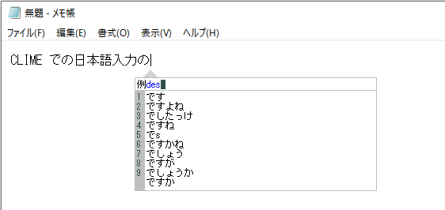

# CLIME

　CLIME (Common Lisp Input Method Engine) は予測変換型のテキスト入力システムです。

　CLIME は増井俊之氏が作成した POBox に改変を加えたアプリケーションです。
サーバは Common Lisp 言語で完全に書き直されており、クライアントプログラム
にも多くの変更が加えられています。オリジナルの POBox との違いについては、
を参照してください。

## インストール

　ダウンロードした ZIP ファイルを展開し、任意の場所に置くだけです。試していない
のですが、空白文字を含むようなパスは避けた方が良いかもしれません。

　Windows クライアント（winclime.exe）は Cygwin を使用しています。以下の
ファイルはそのために必要になるファイルで、64bit Cygwin をインストールしている
環境では必要ありません。

* cygwin1.dll
* cygstdc++-6.dll
* cyggcc_s-seh-1.dll

## アンインストール

　インストール時に置いたファイルを消すだけです。

## 使い方

### サーバの起動

　climesrv-start.bat を実行してください。以下のようにいわゆる DOS 窓が開いて
CLIME のサーバプロセスが起動します。

　サーバプロセスを終了させる方法については、を参照してください。

### Windows クライアント

　**サーバを起動させてから** winclime.exe を実行してください。以下のような入力
ウィンドウが表示されます。

　この入力ウィンドウは Alt+J を押すたびに表示／非表示が切り替わります。

* ToDo : 起動と終了
* ToDo : Alt+J による変換ウィンドウの表示／非表示切り替え
* ToDo : 基本的な入力、候補選択、Enterによる確定、さらにEnterによるターゲットへの貼り付け
* ToDo : Ctrl+J による変換の有効／無効切り替え
* ToDo : 単語登録と単語削除　⇒　これは「高度な使い方」か？

* 64bit cygwin

### Emacs クライアント

### サーバの終了

　サーバプロセスを終了させるには、 **クライアントを終了させてから** サーバプロセスの
DOS 窓で Ctrl+C を押してください。すると「バッチジョブを終了しますか(Y/N)？」と
聞かれるので、y を押してから Enter です。

## POBoxとの相違点

　ここでは、オリジナルの POBox と CLIME の違いを簡単にまとめています。

### サーバ

* プロトコルの追加
    * C：コンテクストクリア
    * E：辞書列挙
    * I：辞書情報
    * L：ログレベル設定
    * Q：シャットダウン
    * W：ログ転送
* 学習辞書のエントリ数に上限を設定する機能
* 辞書への変更をマークし、必要な時だけ保存する機能

### Windows クライアント

* 〔単語登録〕機能
* 〔単語削除〕機能
* 〔日付と時刻の挿入〕機能
* 〔ダイレクトキー〕機能
* 〔番号による候補選択〕機能
* 〔確定時自動検索〕機能
* 〔透過表示〕機能
* 外観
    * 変換ウィンドウの外観設定
    * 〔カラーテーマ〕機能
    * アイコンの刷新（まだ暫定）
* 変換ウィンドウの位置制御
    * マルチウィンドウ環境における制御
    * 変換ウィンドウが画面の左右端からはみ出さないようにする制御
    * 画面下端付近においてキャレットの上側に変換ウィンドウを表示する制御
* 〔ショートカットキー〕の拡充
    * Alt+Q で終了
    * Ctrl+O で単語登録
    * Ctrl+Q で単語削除
    * Ctrl+I でインデックス機能のトグル
    * Ctrl+1～9 で数字入力
    * Ctrl+Space で半角スペース入力
    * Esc で変換キャンセル
    * Alt+F1 でバージョン情報ダイアログ表示
    * F1 でマニュアルページ表示（このドキュメント）
    * F2 でカラーテーマ切り替え
* 〔Emacsキーバインド〕の拡充
    * Ctrl+T で文字入れ替え
    * Ctrl+N で次候補
    * Ctrl+P で前候補
    * 特定条件下でのEmacsキーイベントのターゲットウィンドウへの転送
* その他
    * 最小化からの復帰時に変換の有効／無効状態を保持
    * 二重起動の防止

### Emacs クライアント

* 単語登録機能の改善
* 日時文字列挿入機能
